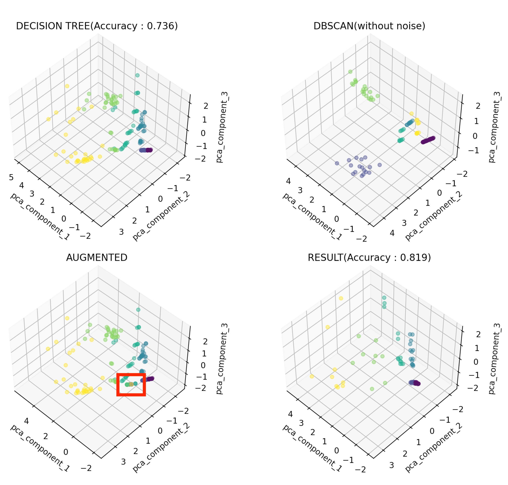

# CDBSMOTE
CDBSMOTE(=Class and Density Based Synthetic Minority Oversampling Technique) is a result of a convergence between machine learning algorithms(Decision Tree, DBSCAN) and an educational engineering(JIGSAW).

## Core idea
* Through a JIGSAW model from educational engineering, the output of the mutual teaching between the Decision Tree and the DBSCAN can find a low density point. It is a key point for the data augmentation.

## Preview

## Branch
* report-kips : the result of a paper for 'Korea Information Processing Society'
* report-pknu : the result of masters degree report at the Pukyong National University